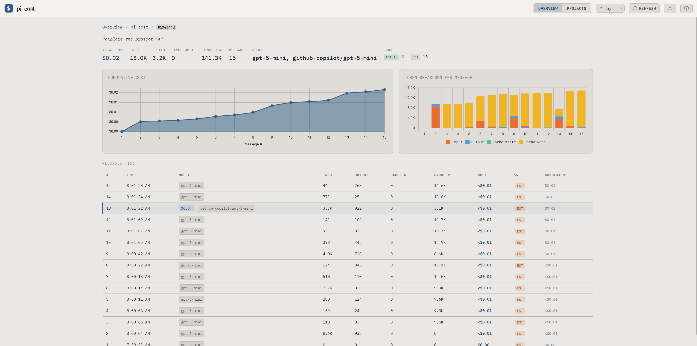
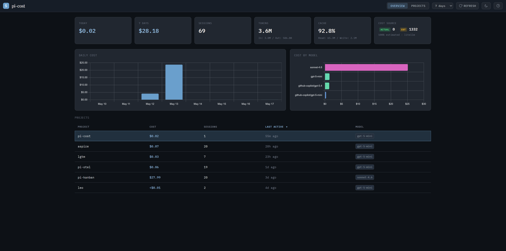
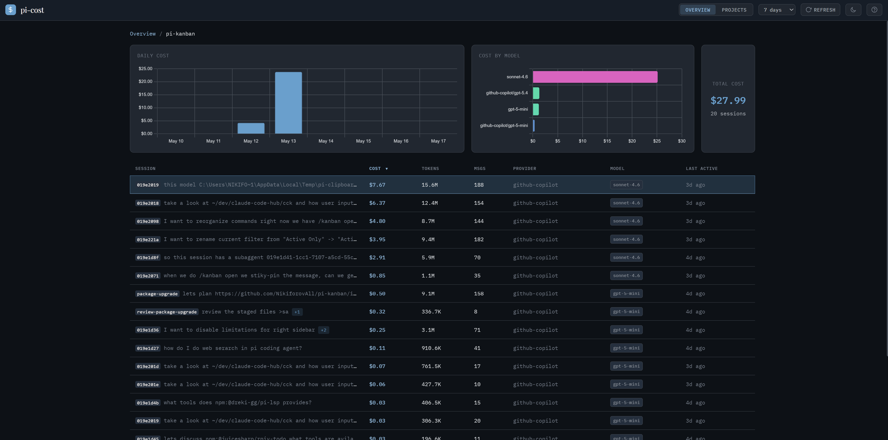
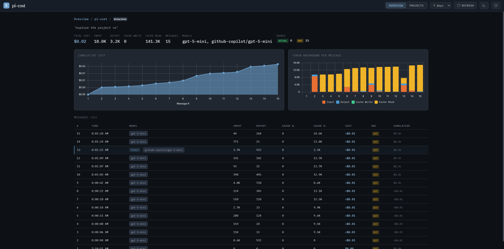

# pi-cost

[](https://www.npmjs.com/package/pi-cost)
[](https://www.npmjs.com/package/pi-cost)

Cost dashboard for the [pi coding agent](https://pi.dev) — overview → project → session → message, with actual and estimated spend.

[](https://github.com/user-attachments/assets/f9383f3f-4379-4ca6-b920-badb35f5eea8)

## Documentation

**[→ See the documentation](https://nikiforovall.github.io/pi-cost/)**

User guide, cost-source model, keyboard shortcuts, and theme authoring all live there.

## Installation

```sh
pi install npm:pi-cost
```

Then use `/cost start | stop | restart | status | open` from inside pi.

Or run standalone:

```sh
npx pi-cost
```

Open `http://localhost:5461` — `npm run dev` auto-opens the browser.

### From source

```sh
git clone https://github.com/NikiforovAll/pi-cost
cd pi-cost
npm install
npm start              # http://localhost:5461
pi --add ./extensions  # register as a pi extension
```

## Screenshots

| View            | Preview                                      |
| --------------- | -------------------------------------------- |
| Overview        |            |
| Project         |              |
| Session         |              |
| Session (light) |  |
